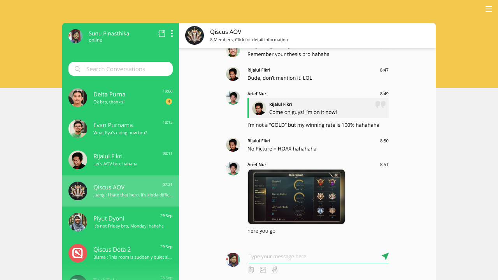

## Qiscus Chat SDK Web Sample Apps



To understand Qiscus Chat SDK easier, we provide some Sample Apps. Inside
these samples, you can see our how Qiscus Chat SDK can power your app. You
can directly try some default feature or UI customization. To start with the
sample apps, you can clone from repository or try the live sample online via
codepen.

## Requirement

To run all of the sample code, you need to install Git and NodeJS. Git will be
used to clone the repository so you can play around with the code locally.
NodeJS is needed to install and resolve dependencies to run the Sample App. You
can refer to their respected page for more detail installing them both.

[git-scm.com](http://git-scm.com)
[nodejs.org](http://nodejs.org)

## Cloning Sample App
You can download sample directly from our github at
[github.com/qiscus/qiscus-sdk-web-sample](https://github.com/qiscus/qiscus-sdk-web-sample)
or if you already installed Git you can just clone directly from your
command line.

```bash
$ git clone https://github.com/qiscus/qiscus-sdk-web-sample.git
```
After cloning finished, you will need to create simple server to run the sample
app. In the example below, we use `http-server` from nodejs package manager to
serve Sample App locally.

```bash
# Install http-server from npm globally
$ npm install http-server -g
# Choose folder and run Web SDK Sample
$ cd qiscus-sdk-web-sample
$ http-server
```
If you want your sample app running with your own APP ID, you can change it in file vars.js which is located at assets/js/vars.js.
